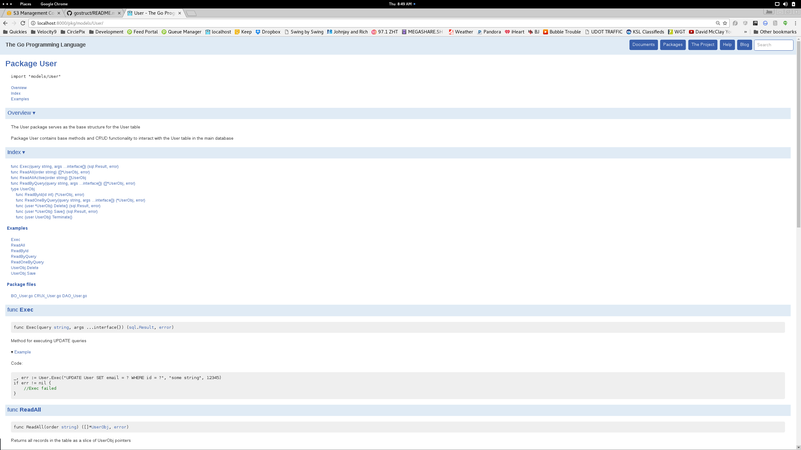
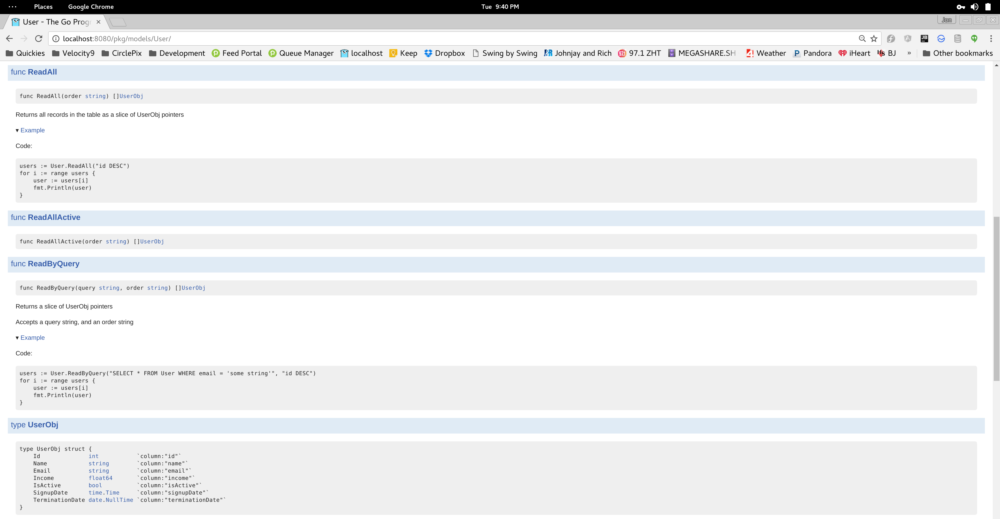
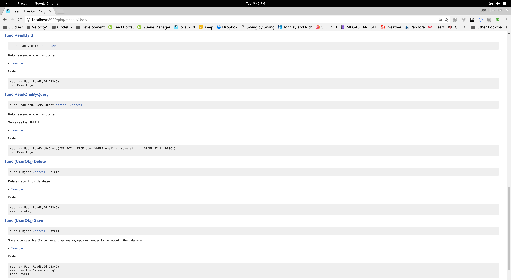
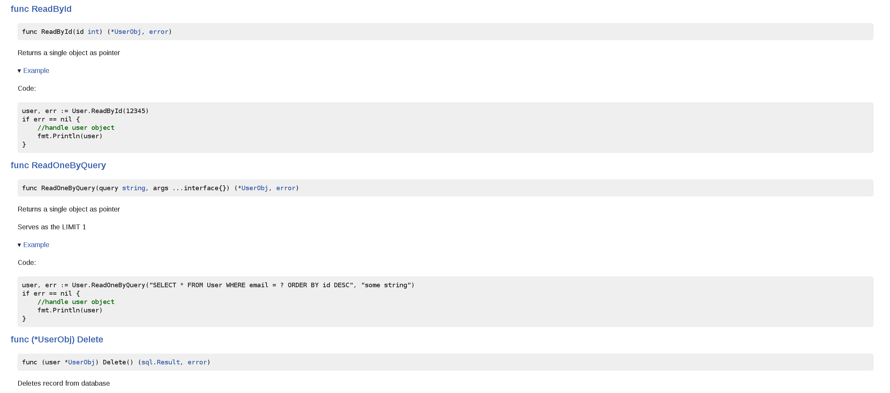
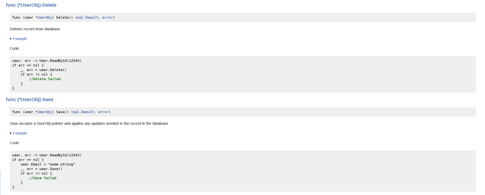

# gostruct
This is a library to auto-generate models with packages, structs, and basic methods of accessibility for a given MySQL database table.

# implementation

    go get github.com/go-sql-driver/mysql
    go get github.com/jonathankentstevens/gostruct

Replace the {username} and {password} constants in gostruct.go to the credentials of your database. Then create a generate.go file with the following contents:

```go
package main

import (
    _ "github.com/go-sql-driver/mysql"
    "github.com/jonathankentstevens/gostruct"
    "log"
)

func main() {
    err := gostruct.Generate()
    if err != nil {
        log.Fatalln(err)
    }
}
```
    
Then, run:

    go run generate.go -table User -database main -host localhost
    
A package with a struct of the table and several methods to handle common requests will be created in the $GOPATH/src/models/{table} directory. The files that are created, for a 'User' model (for example) would be: CRUX_User.go (containing the main CRUX methods and common methods such as ReadById, ReadAll, ReadOneByQuery, ReadByQuery, and Exec), DAO_User.go (this will hold any custom methods used to return User object(s)), BO_User.go (this contains methods to be called on the User object itself), a User_test.go to serve as a base for your unit testing and an examples_test.go with auto-generated example methods for godoc readability. In addition, it will generate a connection package to share a connection between all your models to prevent multiple open database connections, a logger package to handle any errors, and a date package to implement a "sql.NullTime"-like  struct type for null date values in any MySQL result set.

# flags 

table
    
    MySQL database table
    
database
    
    Name of the MySQL database
    
host
    
    Hostname or server of where the database is located
    
port

    Defaults to 3306 if not provided
    
all

    If this option is passed in as "true", it will run for all tables based on the database

# usage
```go
package main

import (
    "models/User"
)

func main() {
    //retrieve existing user by id
    user, err := User.ReadById(12345)
    if err == nil {
	    user.Email = "test@email.com"
	    user.IsActive = false
	    user.Save()
    }
    
    //create new user
    user := new(User.UserObj)
    user.Email = "test@email.com"
    _, err := user.Save()
    if err != nil {
    	//Save failed
    }

    //delete user
    _, err := user.Delete()
    if err != nil {
    	//Delete failed
    }
}
```
# DAO_User.go - sample method to include
```go
func ReadAllActive(order string) ([]*UserObj, error) {
	orderStr := ""
	if order != "" {
		orderStr = " ORDER BY " + order
	}
	return ReadByQuery("SELECT * FROM User WHERE IsActive = '1'" + orderStr)
}
```
Usage:
```go
func main() {
	users, err := User.ReadAllActive("Name ASC")
	if err == nil {
		//handle users
		fmt.Println(users)
	}
}
```
# BO_User.go - sample method to include
```go
func (user *UserObj) Terminate() {
	user.IsActive = false
	user.TerminationDate.Time = time.Now()
	_, err := user.Save()
	if err != nil {
		//Save failed
	}
}
```
Usage:
```go
func main() {
	users, err := User.ReadAllActive("Name ASC")
	if err == nil {
		for i := range users {
			user := users[i]
			user.Terminate()
		}
	}
}
```
# CRUX_User.go - sample file
```go
//Package User contains base methods and CRUD functionality to
//interact with the User table in the main database
package User

import (
	"connection"
	"database/sql"
	"logger"
	"reflect"
	"strings"
	"utils"
	"utils/date"
)

//UserObj is the structure of the home table
//
//This contains all columns that exist in the database
type UserObj struct {
	Id              int           `column:"id" default:""`
	Name            string        `column:"name" default:""`
	Email           string        `column:"email" default:""`
	Income          float64       `column:"income" default:"0"`
	IsActive        bool          `column:"isActive" default:"1"`
	SignupDate      date.NullTime `column:"signupDate" default:""`
	TerminationDate date.NullTime `column:"terminationDate" default:""`
}

//Save accepts a UserObj pointer
//
//Turns each value into it's string representation
//so we can save it to the database
func (user *UserObj) Save() (sql.Result, error) {
	v := reflect.ValueOf(user).Elem()
	objType := v.Type()

	columnArr := make([]string, 0)
	args := make([]interface{}, 0)
	q := make([]string, 0)

	updateStr := ""
	query := "INSERT INTO User"
	for i := 0; i < v.NumField(); i++ {
		args = append(args, value.GetFieldValue(v.Field(i), objType.Field(i).Tag.Get("default")))
		column := string(objType.Field(i).Tag.Get("column"))
		columnArr = append(columnArr, "`"+column+"`")
		q = append(q, "?")
		if i > 0 {
			updateStr += ", "
		}
		updateStr += "`" + column + "` = ?"
	}
	query += " (" + strings.Join(columnArr, ", ") + ") VALUES(" + strings.Join(q, ", ") + ") ON DUPLICATE KEY UPDATE" + updateStr
	newArgs := append(args, args...)
	newRecord := false
	if value.Empty(user.Id) {
		newRecord = true
	}

	res, err := Exec(query, newArgs...)
	if err == nil && newRecord {
		id, _ := res.LastInsertId()
		user.Id = int(id)
	}
	return res, err
}

//Deletes record from database
func (user *UserObj) Delete() (sql.Result, error) {
	return Exec("DELETE FROM User WHERE id = ?", user.Id)
}

//Returns a single object as pointer
func ReadById(id int) (*UserObj, error) {
	return ReadOneByQuery("SELECT * FROM User WHERE id = ?", id)
}

//Returns all records in the table
func ReadAll(order string) ([]*UserObj, error) {
	query := "SELECT * FROM User"
	if order != "" {
		query += " ORDER BY " + order
	}
	return ReadByQuery(query)
}

//Returns a slice of UserObj pointers
//
//Accepts a query string, and an order string
func ReadByQuery(query string, args ...interface{}) ([]*UserObj, error) {
	connection := DB.GetConnection()
	objects := make([]*UserObj, 0)
	query = strings.Replace(query, "'", "\"", -1)
	rows, err := connection.Query(query, args...)
	if err != nil {
		Logger.HandleError(Logger.ERROR_TYPE_CODE_ALERT, err)
		return objects, err
	} else {
		for rows.Next() {
			var user UserObj
			rows.Scan(&user.Id, &user.Name, &user.Email, &user.Income, &user.IsActive, &user.SignupDate, &user.TerminationDate)
			objects = append(objects, &user)
		}
		err = rows.Err()
		if len(objects) == 0 {
			return objects, sql.ErrNoRows
		} else if err != nil && err != sql.ErrNoRows {
			Logger.HandleError(Logger.ERROR_TYPE_CODE_ALERT, err)
			return objects, err
		}
		rows.Close()
	}

	return objects, nil
}

//Returns a single object as pointer
//
//Serves as the LIMIT 1
func ReadOneByQuery(query string, args ...interface{}) (*UserObj, error) {
	var user UserObj

	con := DB.GetConnection()
	query = strings.Replace(query, "'", "\"", -1)
	err := con.QueryRow(query, args...).Scan(&user.Id, &user.Name, &user.Email, &user.Income, &user.IsActive, &user.SignupDate, &user.TerminationDate)
	if err != nil && err != sql.ErrNoRows {
		Logger.HandleError(Logger.ERROR_TYPE_CODE_ALERT, err)
	}

	return &user, err
}

//Method for executing UPDATE queries
func Exec(query string, args ...interface{}) (sql.Result, error) {
	con := DB.GetConnection()
	result, err := con.Exec(query, args...)
	if err != nil {
		Logger.HandleError(Logger.ERROR_TYPE_CODE_ALERT, err)
	}

	return result, err
}
```

# User_test.go - sample file
```go
package User_test

import (
	"testing"
)

func TestSomething(t *testing.T) {
	//test stuff here..
}
```
# examples_test.go - sample file
```go
package User_test

import (
	"fmt"
	"models/User"
)

func ExampleUserObj_Save() {
	user, err := User.ReadById(12345)
	if err == nil {
		user.Email = "some string"
		_, err = user.Save()
		if err != nil {
			//Save failed
		}
	}
}

func ExampleUserObj_Delete() {
	user, err := User.ReadById(12345)
	if err == nil {
		_, err = user.Delete()
		if err != nil {
			//Delete failed
		}
	}
}

func ExampleReadAll() {
	users, err := User.ReadAll("id DESC")
	if err == nil {
		for i := range users {
			user := users[i]
			fmt.Println(user)
		}
	}
}

func ExampleReadById() {
	user, err := User.ReadById(12345)
	if err == nil {
		//handle user object
		fmt.Println(user)
	}
}

func ExampleReadByQuery() {
	users, err := User.ReadByQuery("SELECT * FROM User WHERE email = ? ORDER BY id DESC", "some string")
	if err == nil {
		for i := range users {
			user := users[i]
			fmt.Println(user)
		}
	}
}

func ExampleReadOneByQuery() {
	user, err := User.ReadOneByQuery("SELECT * FROM User WHERE email = ? ORDER BY id DESC", "some string")
	if err == nil {
		//handle user object
		fmt.Println(user)
	}
}

func ExampleExec() {
	_, err := User.Exec("UPDATE User SET email = ? WHERE id = ?", "some string", 12345)
	if err != nil {
		//Exec failed
	}
}
```
# logger.go - base package
```go
package logger

import (
	"database/sql"
	"fmt"
	"log"
	"net"
	"os"
	"runtime"
	"strings"
)

var datetime string
var hostname string
var ip string
var line int
var pc uintptr
var class string
var method string
var file string

//Method to set all variables used in all functions of logging
func setVars() {
	t := time.Now()
	datetime = t.Format("2006-01-02 15:04:05")
	hostname, _ = os.Hostname()
	ipArr, _ := net.LookupHost(hostname)
	if len(ipArr) == 1 {
		ip = ipArr[0]
	}
	pc, file, line, _ = runtime.Caller(3)
	path := runtime.FuncForPC(pc).Name()
	pathArgs := strings.Split(path, ".")
	class = pathArgs[0]
	method = pathArgs[1]
}

func HandleError(e interface{}) {
	setVars()

	if e == sql.ErrNoRows {
		//handle queries with no results
	} else {
		errorStr := fmt.Sprintf("%s %s(%s.%s):%d - %s", datetime, file, class, method, line, e.Error())
		log.Fatalln(errorStr)
	}
}
```
# connection.go base package
```go
package connection

import (
	"database/sql"
	_ "github.com/go-sql-driver/mysql"
	"logger"
)

var connection *sql.DB
var err error

func Get() *sql.DB {
	if connection != nil {
		//determine whether connection is still alive
		err = connection.Ping()
		if err == nil {
			return connection
		}
	}

	connection, err = sql.Open("mysql", "{username}:{password}@tcp({host}:{port})/{database}?parseTime=true")
	if err != nil {
		logger.HandleError(err)
	}

	return connection
}
```
# Screenshots of godocs created from auto-generated package





