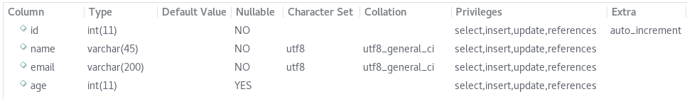

[](http://www.gnu.org/licenses/gpl-3.0.html)
[](https://goreportcard.com/report/github.com/jonathankentstevens/gostruct)
[](https://godoc.org/github.com/jonathankentstevens/gostruct)
[](https://travis-ci.org/jonathankentstevens/gostruct)

# gostruct
Library to auto-generate packages and basic CRUD operations for a given MySQL database table.

# dependencies

    github.com/go-sql-driver/mysql
    github.com/pkg/errors
    
# implementation

    go get github.com/jonathankentstevens/gostruct

Create a generate.go file with the following contents (including your db username/password):

```go
package main

import (
	"github.com/jonathankentstevens/gostruct"
)

func main() {
	gs := new(gostruct.Gostruct)
	gs.Username = "{username}"
	gs.Password = "{password}"
	err := gs.Generate()
	if err != nil {
		println("Generate Error:", err)
	}
}
```

Assume you had a 'user' table with the following schema:



...you would run:

	go run generate.go -tables user -db {db} -host {host}
    
A package with a struct of the table and several methods to handle common requests will be created in the $GOPATH/src/models/{table} directory. The files that are created, for a 'User' model (for example) would be:

- User_base.go
    
    - contains the main CRUD methods: Save(insert/update) & Delete, and common functions such as: ReadByKey, ReadAll, ReadOneByQuery, ReadByQuery, and Exec
    
    - This also validates any enum/set data type with the value passed to ensure it is one of the required fields before persisting to the database
- User_extended.go
    
    - this will hold any custom methods and functions used in accordance with the User model. This package should not import any other model packages to avoid cyclical imports
- User_test.go
    
    - serves as a base for your unit testing

It will also generate a connection package to share connection(s) to prevent multiple open database connections. The generated package(s) implement the connection.Info interface that allows you derive the 
type and typeId (table & primary key) from any object by simple calling:

```go
user, _ := User.ReadByKey(12345)
table, pk := user.TypeInfo()
```

The pattern for generating packages for multiple tables is just a comma-separated list:

    go run generate.go -tables table1,table2,table3 -db {db} -host {host}

# flags 

tables
    
    Comma-separated list of MySQL database tables
    
db
    
    Name of the MySQL database
    
host
    
    Hostname or server of where the database is located
    
port

    Defaults to 3306 if not provided
    
all

    If this option is passed in as "true", it will run for all tables based on the database
    
nameFuncs

    Set this flag to true if you want the struct name included in the auto-generated method/function names

# usage
```go
package main

import (
    "models/User"
)

func main() {
    // retrieve existing user by id
    user, err := User.ReadByKey(12345)
    if err != nil {
        // handle error
    }
	user.Email = "test@email.com"
    user.Save()    
    
    // create new user
    user := new(User.User)
    user.Email = "test@email.com"
    res, err := user.Save()
    if err != nil {
    	// save failed
    }

    // delete user
    _, err := user.Delete()
    if err != nil {
    	// delete failed
    }
}
```
<b>User_extended.go - sample function to include</b>

```go
func ReadAllActive(options connection.QueryOptions) ([]*UserObj, error) {
	return ReadByQuery("SELECT * FROM User WHERE IsActive = '1'", options)
}
```
Usage:
```go
func main() {
	users, err := User.ReadAllActive(connection.QueryOptions{OrderBy: "Name ASC"})
	if err != nil {
		// handle error
	}
	
	// handle users
	for _, user := range users {
	    
	}
}
```

<b>User_extended.go - sample method to include</b>

```go
func (user *UserObj) Terminate() error {
	user.IsActive = false
	user.TerminationDate = time.Now().Local()
	_, err := user.Save()
	if err != nil {
		// save failed
		return err
	}
	return nil
}
```
Usage:
```go
func main() {
	users, err := User.ReadAllActive(connection.QueryOptions{OrderBy: "Name ASC"})
	if err != nil {
	    // read failed or no results found
	} else {
	    // handle users
		for _, user := range users {
			err = user.Terminate()
			if err != nil {
			    // handle error 
			}
		}
	}
}
```

# developers

  - extend the functionality of connection.QueryOptions to include Offset and other common MySQL query options
        
      - to do this, update the connection.QueryOptions struct to include any new options and then update the connection.ApplyQueryOptions function to handle the new options

# example generated code

<b>User_base.go - sample file</b>
```go
// Package User contains base methods and CRUD functionality to
// interact with the user table in the sys database
package User

import (
	"connection"
	"database/sql"
	"reflect"
	"strings"

	_ "github.com/go-sql-driver/mysql"
	"github.com/pkg/errors"
)

// User is the structure of the home table
type User struct {
	Id    int64  `column:"id" default:"" type:"int(11)" key:"PRI" null:"NO" extra:"auto_increment"`
	Name  string `column:"name" default:"" type:"varchar(45)" key:"" null:"NO" extra:""`
	Email string `column:"email" default:"" type:"varchar(200)" key:"" null:"NO" extra:""`
	Age   *int64 `column:"age" default:"" type:"int(11)" key:"" null:"YES" extra:""`
}

// user is the nilable structure of the home table
type user struct {
	Id    int64
	Name  string
	Email string
	Age   sql.NullInt64
}

// TableName returns the name of the mysql table
func (obj *User) TableName() string {
	return "user"
}

// PrimaryKeyInfo returns the string value of the primary key column and the corresponding value for the receiver
func (obj *User) PrimaryKeyInfo() (string, interface{}) {
	val := reflect.ValueOf(obj).Elem()
	var objTypeId interface{}
	for i := 0; i < val.NumField(); i++ {
		valueField := val.Field(i)
		column := val.Type().Field(i).Tag.Get("column")
		if "id" == column {
			switch valueField.Kind() {
			case reflect.Int:
				objTypeId = valueField.Interface().(int)
			case reflect.Int64:
				objTypeId = valueField.Interface().(int64)
			case reflect.String:
				objTypeId = valueField.Interface().(string)
			}
		}
	}

	return "id", objTypeId
}

// TypeInfo implements mysql.Info interface to allow for retrieving type/typeId for any db model
func (obj *User) TypeInfo() (string, interface{}) {
	_, pkVal := obj.PrimaryKeyInfo()
	return "user", pkVal
}

// Save runs an INSERT..UPDATE ON DUPLICATE KEY and validates each value being saved
func (obj *User) Save() (sql.Result, error) {
	v := reflect.ValueOf(obj).Elem()
	args, columns, q, updateStr, err := connection.BuildQuery(v, v.Type())
	if err != nil {
		return nil, errors.Wrap(err, "field validation error")
	}
	query := "INSERT INTO user (" + strings.Join(columns, ", ") + ") VALUES (" + strings.Join(q, ", ") + ") ON DUPLICATE KEY UPDATE " + updateStr
	newArgs := append(args, args...)
	newRecord := false
	if obj.Id == 0 {
		newRecord = true
	}

	res, err := Exec(query, newArgs...)
	if err == nil && newRecord {
		id, _ := res.LastInsertId()
		obj.Id = id
	}
	if err != nil {
		err = errors.Wrap(err, "save failed for user")
	}

	return res, err
}

// Delete removes a record from the database according to the primary key
func (obj *User) Delete() (sql.Result, error) {
	return Exec("DELETE FROM user WHERE id = ?", obj.Id)
}

// ReadByKey returns a single pointer to a(n) User
func ReadByKey(id int64) (*User, error) {
	return ReadOneByQuery("SELECT * FROM user WHERE id = ?", id)
}

// ReadAll returns all records in the table
func ReadAll(options ...connection.QueryOptions) ([]*User, error) {
	return ReadByQuery("SELECT * FROM user", options)
}

// ReadByQuery returns an array of User pointers
func ReadByQuery(query string, args ...interface{}) ([]*User, error) {
	var objects []*User

	con, err := connection.Get("sys")
	if err != nil {
		return objects, errors.Wrap(err, "connection failed")
	}

	newArgs := connection.ApplyQueryOptions(&query, args)
	query = strings.Replace(query, "'", "\"", -1)
	rows, err := con.Query(query, newArgs...)
	if err != nil {
		return objects, errors.Wrap(err, "query error")
	}

	rowsErr := rows.Err()
	if rowsErr != nil {
		return objects, errors.Wrap(err, "rows error")
	}

	defer rows.Close()
	for rows.Next() {
		var obj user
		err = rows.Scan(&obj.Id, &obj.Name, &obj.Email, &obj.Age)
		if err != nil {
			return objects, errors.Wrap(err, "scan error")
		}
		objects = append(objects, &User{obj.Id, obj.Name, obj.Email, &obj.Age.Int64})
	}

	if len(objects) == 0 {
		err = errors.Wrap(sql.ErrNoRows, "no records found")
	}

	return objects, err
}

// ReadOneByQuery returns a single pointer to a(n) User
func ReadOneByQuery(query string, args ...interface{}) (*User, error) {
	var obj user

	con, err := connection.Get("sys")
	if err != nil {
		return nil, errors.Wrap(err, "connection failed")
	}

	query = strings.Replace(query, "'", "\"", -1)
	err = con.QueryRow(query, args...).Scan(&obj.Id, &obj.Name, &obj.Email, &obj.Age)
	if err != nil && err != sql.ErrNoRows {
		return nil, errors.Wrap(err, "query/scan error")
	}

	return &User{obj.Id, obj.Name, obj.Email, &obj.Age.Int64}, nil
}

// Exec allows for update queries
func Exec(query string, args ...interface{}) (sql.Result, error) {
	con, err := connection.Get("sys")
	if err != nil {
		return nil, errors.Wrap(err, "connection failed")
	}
	return con.Exec(query, args...)
}
```

<b>User_test.go - sample skeleton file generated</b>
```go
package User_test

import (
	"testing"
)

func TestSomething(t *testing.T) {
	//test stuff here..
}
```
